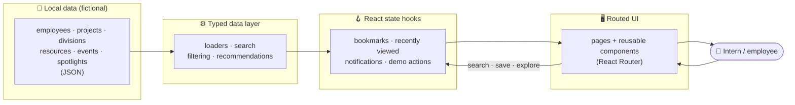

<div align="center">


# CDOT Compass

### Intelligent career navigation for the people who keep Colorado moving.

Discover divisions, projects, mentors, and career pathways across CDOT —
in one place, in minutes instead of weeks.

<br/>

[](https://cdot-compass.vercel.app)

<br/>


<br/>


</div>

> [!NOTE]
> **CDOT Compass is an independent Innovation Challenge prototype** created during a summer internship. It is **not an official CDOT product**, and every employee, project, resource, and event shown is **fictional sample data** for demonstration only.

---

## The story behind it

I started as a bridge intern, excited and a little lost.

Within my first week I kept hearing about things I wished I'd known on day one — a mentor in Hydraulics who loved teaching, a field day over in Aviation, a project that could've used a fresh set of eyes. The opportunities were real and they were *everywhere*. But there was no map.

I realized CDOT didn't have a discovery problem because it lacked opportunities. It had one because those opportunities were **scattered** — across emails, SharePoint folders, Teams channels, networking events, hallway conversations, and the memory of whoever happened to be in the room. If you knew exactly who to ask, you found it. If you didn't, you missed it.

So I built the thing I wished I'd had.

---

## The problem

For a new intern, rotational engineer, or recent hire, the first question is rarely *"what's the answer?"* — it's **"where do I even look?"**

<table>
<tr>
<td width="50%" valign="top">

**Information is fragmented**
Opportunities live in a dozen disconnected places, none of them searchable together.

**Discovery depends on luck**
You find a mentor or a project because you happened to sit next to the right person.

</td>
<td width="50%" valign="top">

**Onboarding is slow**
It can take weeks to build the mental map of CDOT that a tool could give you in minutes.

**Talent gets missed**
Great people and the divisions where they'd thrive never quite find each other.

</td>
</tr>
</table>

---

## The solution

> [!IMPORTANT]
> **CDOT Compass doesn't create new programs.** It helps people discover and make better use of the incredible opportunities that **already exist** — making them *visible, searchable, and easy to act on.*

A single, calm, enterprise-grade workspace where an intern can land on day one and immediately understand **where to go next and why.**

---

## Product highlights

Capabilities are organized around what an employee is actually trying to do:

### 🧭 Discover
- **Compass Guide** — a short, practical questionnaire that returns *explainable*, rules-based recommendations (no black box)
- **Personalized dashboard** — recommendations, recently viewed, saved items, and onboarding progress at a glance
- **Global search (⌘K)** — Spotlight-style jump to any person, project, division, resource, or event

### 🤝 Connect
- **People directory & profiles** — find colleagues, mentors, and the work behind their names
- **Coffee Chat & Job Shadow flows** — turn "I should reach out" into a copy-ready outreach message in two clicks
- **Employee Spotlights** — real stories that make the org feel human

### 🗺️ Explore
- **Division explorer & detail pages** — understand what each division does and who's there
- **Project Explorer** — see cross-division collaboration, phases, and the people involved
- **Resources & Events** — guides, programs, and meetups, with one-click calendar export

### 📈 Grow
- **Career Path Explorer** — see what each engineering path at CDOT actually involves
- **Executive Impact view** — a leadership-facing read on engagement and reach
- **Saved items & profile** — keep a personal shortlist of where you want to go next

---

## Screenshots

<div align="center">

**Dashboard — a personalized home base**


**Explore Divisions & Division detail**
 

**Compass Guide — explainable recommendations**


**People, Profiles & Coffee Chat**
 

**Project detail & Executive Impact**
 

**Global search (⌘K)**


</div>

> [!TIP]
> **Suggested additions to this gallery:** a mobile/responsive capture (the layout is fully responsive), the Compass Guide *results* screen, and the Spotlights page — they show range beyond the core flows.

---

## Product architecture

CDOT Compass is a fully client-side application. Sample data flows from local JSON, through a typed data and recommendation layer, into stateful hooks and finally the routed UI — no backend, no network round-trips.



**Why this shape?** Keeping everything client-side makes the prototype trivially deployable, fully offline-capable, and safe to share — there is no real employee data and no service to secure.

---

## Technology

| Layer | Choice | Why |
| --- | --- | --- |
| **UI** | React 19 + TypeScript | Type-safe components, modern concurrent rendering |
| **Build** | Vite 6 | Instant dev server, fast production builds, clean code-splitting |
| **Styling** | Tailwind CSS | A consistent design-token system; enterprise look without bespoke CSS |
| **Motion** | Framer Motion | Restrained, reduced-motion-aware transitions |
| **Routing** | React Router 7 | Lazy-loaded routes per page |
| **Data** | Local JSON | Self-contained, offline, no backend or auth |

Every route is lazy-loaded and heavy vendors are split into cached chunks, so the initial load stays small.

---

## Running locally

```bash
npm install
npm run dev
```

Then open **http://localhost:5173**.

| Script | Does |
| --- | --- |
| `npm run dev` | Start the Vite dev server |
| `npm run build` | Type-check + production build to `dist/` |
| `npm run preview` | Serve the production build locally |
| `npm run typecheck` | TypeScript check, no emit |

**Suggested demo path:**
Dashboard → Explore → a Division → People → an Employee Profile → Request Coffee Chat → Projects → Compass Guide → personalized Results → Executive Impact / Spotlights.

---

## Project structure

```
src/
  components/   reusable UI (common, layout, navigation, division, employee, project, …)
  pages/        one component per route
  layouts/      app shell
  hooks/        bookmarks, recently viewed, notifications, demo actions
  utils/        data loaders, search, filtering, recommendations
  config/       navigation, accents, intern profile, notifications
  data/         local JSON sample data (fictional)
  assets/       bundled imagery
scripts/        seed-data generator + screenshot helper (dev only)
```

---

## Design principles

The product is deliberately **calm, not flashy** — it should feel like internal software an enterprise would actually pilot.

- **Clarity over cleverness.** Every screen answers "where do I go next, and why?" Recommendations always explain their reasoning.
- **One design system.** Shared spacing, radius, shadow, and color tokens so every card feels like it belongs to the same product.
- **CDOT identity, restrained.** Primary blues, neutral whites, light-gray surfaces; minimal gradients and no decorative noise.
- **Motion with manners.** Short, gentle transitions that honor `prefers-reduced-motion`.
- **Accessible by default.** Semantic HTML, keyboard navigation, and a ⌘K command surface.

---

## Future roadmap

CDOT Compass is feature-complete as a prototype. The items below are **planned directions, not current functionality.**

| Status | Capability |
| --- | --- |
| ✅ **Today** | Explainable, **rules-based** recommendations across divisions, people, projects, resources & events |
| 🔭 Planned | **AI Career Match** — recommend mentors, divisions & projects from your goals, explained in plain language |
| 🔭 Planned | **Personalized recommendations** that learn from activity and interests |
| 🔭 Planned | **Knowledge graph** of how people, projects, and skills connect |
| 🔭 Planned | **Skills matching** to surface the right people and teams |
| 🔭 Planned | **Internal project recommendations** matched to your strengths |
| 🔭 Planned | **Learning pathways** toward each career goal |

> [!WARNING]
> **No AI is used in this prototype.** Today's recommendations are a transparent, rules-based engine so reviewers can see exactly *why* each suggestion is made. AI Career Match is a future direction only.

---

## What I learned

Building CDOT Compass end-to-end stretched me well beyond writing code:

- **Product thinking** — scoping a real problem, saying no to feature creep, and designing for a *first-day* user.
- **UX & research** — informal interviews and my own onboarding pain shaped the information architecture and microcopy.
- **React architecture** — typed components, lazy-loaded routes, custom hooks for state, and a clean separation between data, logic, and UI.
- **Design systems** — building consistent tokens for spacing, color, and motion instead of one-off styles.
- **Software engineering hygiene** — TypeScript strictness, dead-code/dependency audits, and a clean production build.
- **Git & deployment** — meaningful commits, a versioned release, and a live deployment on Vercel with SPA routing.
- **Stakeholder framing** — translating a technical build into an executive narrative leadership can evaluate in five minutes.

---

## Disclaimer

> [!NOTE]
> CDOT Compass is an **independent Innovation Challenge prototype** and is **not affiliated with, endorsed by, or an official product of** the Colorado Department of Transportation.
> - **All data is fictional.** Employees, projects, resources, and events are representative sample data.
> - **Imagery:** royalty-free transportation photos (Unsplash) bundled locally; avatars are placeholder/illustration sources. The CDOT-styled mark is an original, stylized prototype logo — not the official CDOT logo asset.

---

## Acknowledgements

Built during a summer internship with the encouragement of the mentors, managers, and fellow interns across CDOT who took the time to share what they do — the very conversations that inspired this project.

<div align="center">
<br/>

**[▶ Try the live demo →](https://cdot-compass.vercel.app)**

<sub>Designed & built by <b>Sonia Irakoze</b> · Staff Bridge Intern · CDOT Innovation Challenge</sub>

</div>
