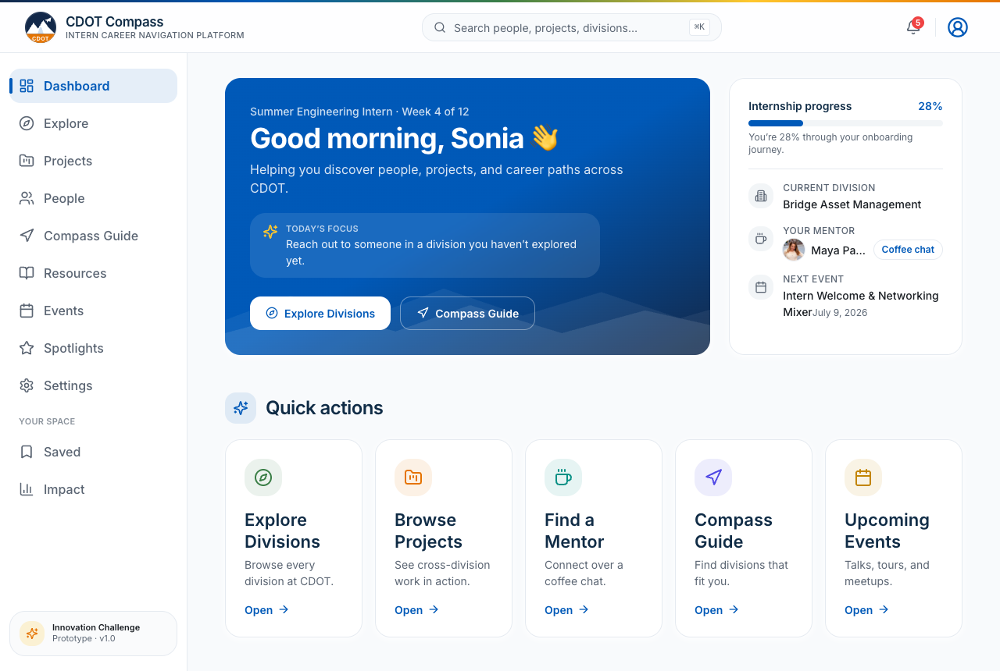
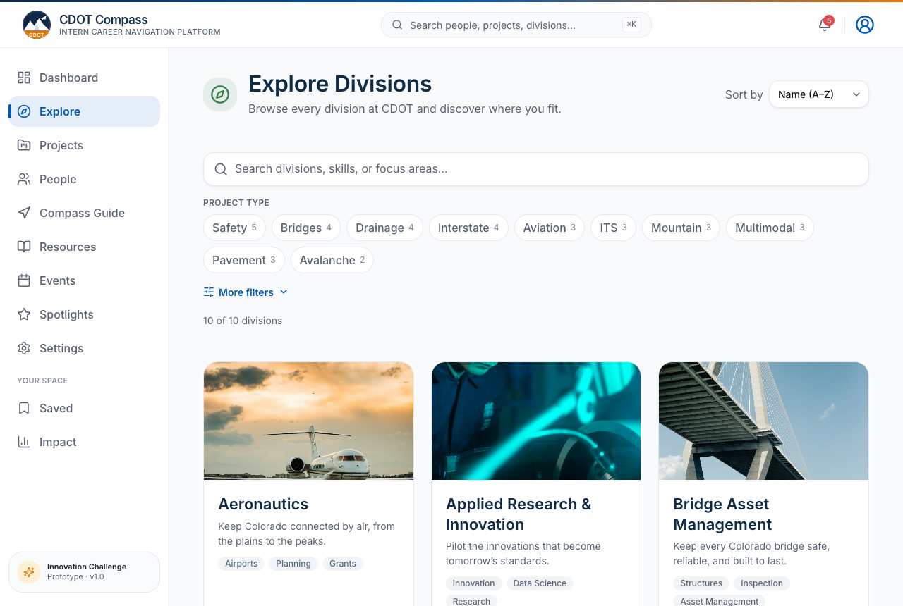
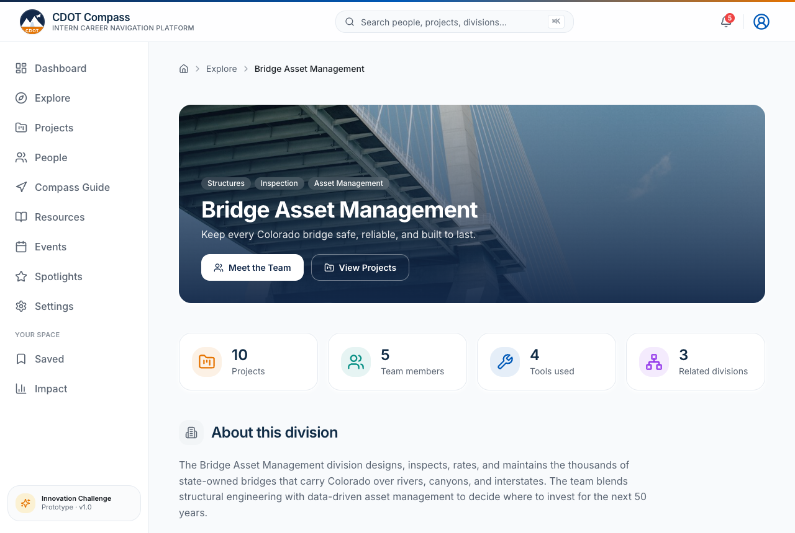
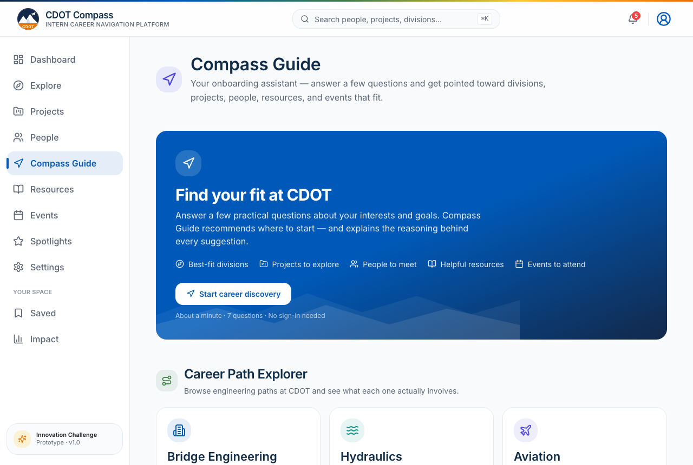
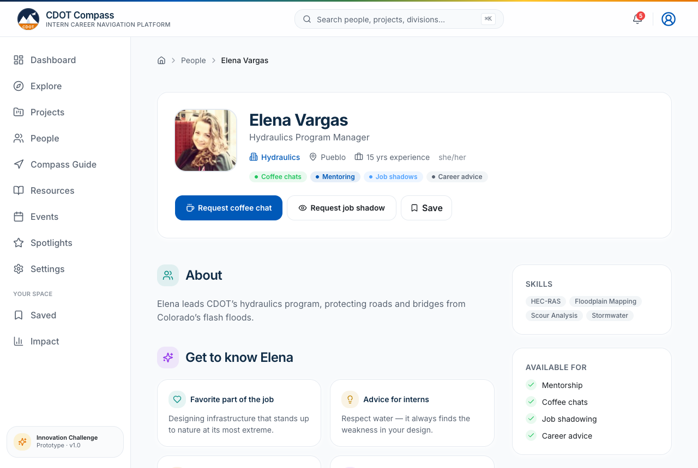
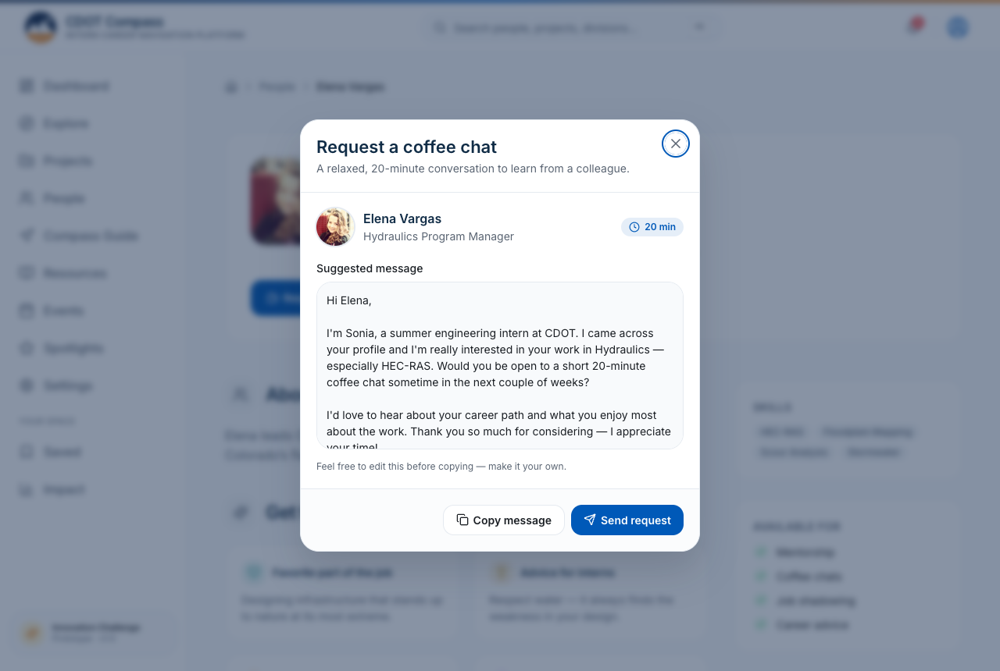
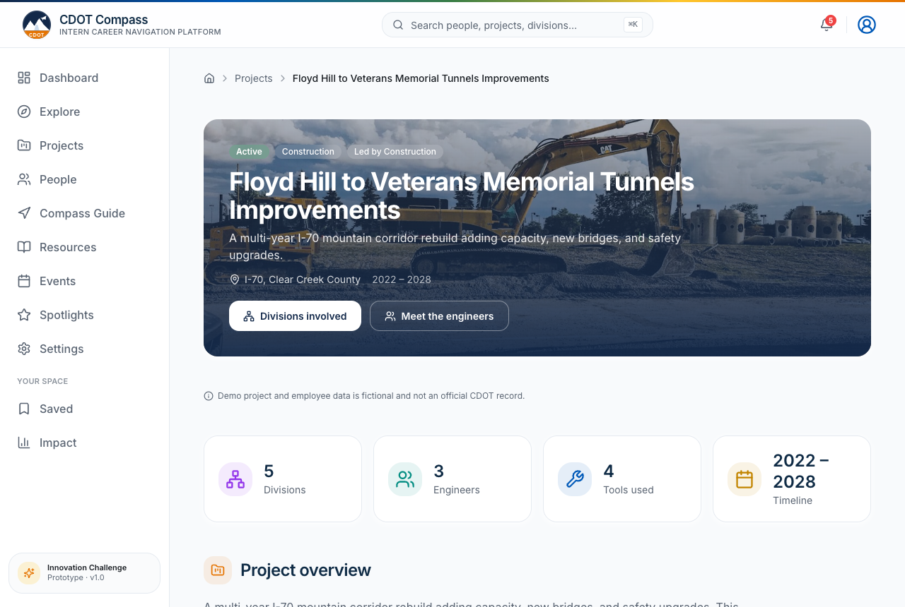
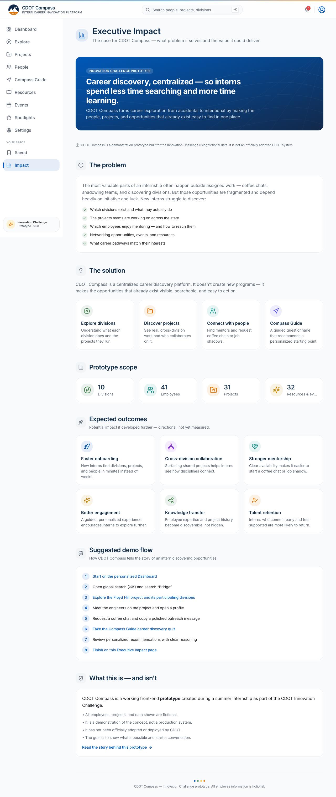
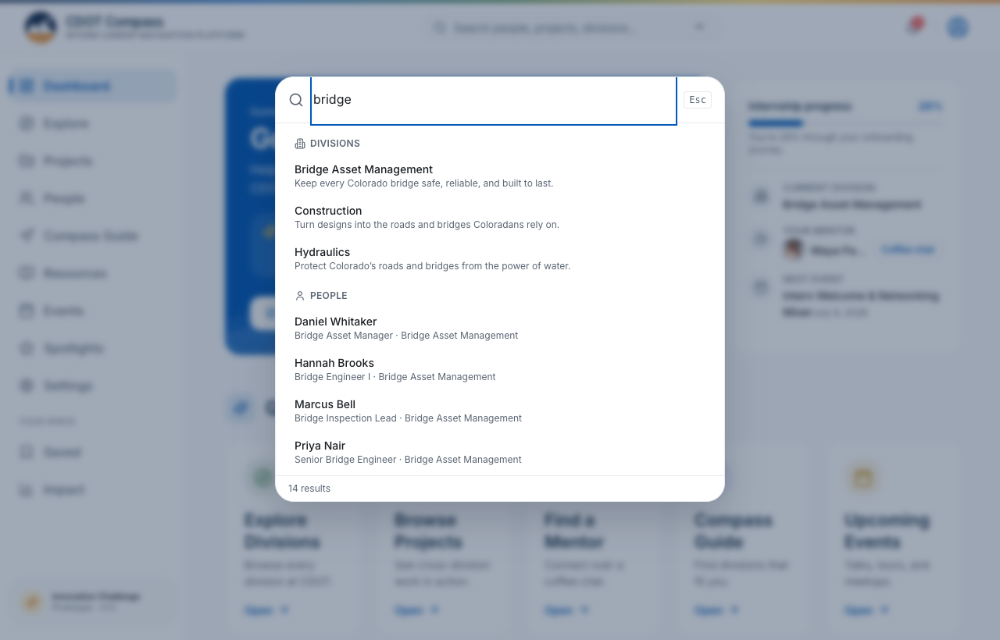

<div align="center">


# CDOT Compass

### A friendlier way to explore everything CDOT already offers.

Discover divisions, projects, people, and career paths across CDOT —
all in one place, easy to explore.

<br/>

[](https://cdot-compass.vercel.app)

<br/>


<br/>



</div>

> [!NOTE]
> **CDOT Compass is an independent Innovation Challenge prototype** created during a summer internship. It is **not an official CDOT product**, and every employee, project, resource, and event shown is **fictional sample data** for demonstration only.

---

## The story behind it

I built CDOT Compass during my summer internship, as my submission for the CDOT Innovation Challenge. It didn't start from a problem I was trying to fix — it started from something I genuinely enjoyed.

One of my favorite parts of the internship was realizing how much interesting work happens across CDOT, well beyond my own team. Almost every week I'd learn about a division, a project, or a career path I hadn't known much about — usually just by talking to people at lunch, at networking events, in meetings, or in passing around the office. I kept leaving those conversations thinking the same few things:

> *"I had no idea this even existed."*
> *"I wish I'd known about it sooner."*
> *"How many other things am I missing simply because I don't know where to look?"*

That last one stuck with me. CDOT already offers so many ways to learn and grow — through its people, projects, divisions, events, resources, career conversations, job shadows, and mentorship. The opportunities are absolutely there. They're just not always easy to find when you're new and still figuring out where to look.

So I started imagining something different: what if you could explore CDOT the way you explore a new city — with a map? One place where you could see what each division does, find projects happening across Colorado, meet the people behind them, learn about different career paths, and set up a coffee chat or job shadow when something caught your eye.

The more I thought about it, the more I realized this wasn't only useful for interns. When someone new doesn't get to see the full breadth of work at CDOT, they might never cross paths with the division, mentor, or project that would have meant the most to them — and CDOT misses a chance to show off the work it's already doing and connect it with the people who'd love to be part of it.

That's the idea CDOT Compass is built around.

---

## The problem

To be clear, this isn't a knock on CDOT — the opportunities are real, and there are a lot of them. The honest challenge is just *discovery*. When you're new, it takes time to learn what exists and where to look, and a few things make that harder than it needs to be.

<table>
<tr>
<td width="50%" valign="top">

**It lives in a lot of places**
Opportunities show up across emails, resource sites, Teams, events, and conversations — rarely all in one place you can search.

**It's easy to walk past**
If you don't already know a project or a mentor exists, you don't know to ask about it.

</td>
<td width="50%" valign="top">

**Getting your bearings takes time**
Building a mental picture of CDOT mostly happens gradually, one conversation at a time.

**There's potential on both sides**
Interns hoping to find their fit, and divisions with work they'd love to share — a little more visibility could help them meet in the middle.

</td>
</tr>
</table>

---

## The solution

> [!IMPORTANT]
> **CDOT Compass doesn't create new programs.** It helps people discover, explore, and make better use of the opportunities that **already exist** — bringing them together somewhere you can actually search and browse them.

It's one place where someone new can land, get their bearings, and start exploring — without having to know the right person to ask first. The goal is simple: on day one, you should be able to see where to go next and why.

---

## Product highlights

Capabilities are organized around what an employee is actually trying to do:

### 🧭 Discover
- **Compass Guide** — a short, practical questionnaire that returns *explainable*, rules-based recommendations (no black box)
- **Personalized dashboard** — recommendations, recently viewed, saved items, and onboarding progress at a glance
- **Global search (⌘K)** — Spotlight-style jump to any person, project, division, resource, or event

### 🤝 Connect
- **People directory & profiles** — find colleagues, mentors, and the work behind their names
- **Coffee Chat & Job Shadow flows** — turn "I should reach out" into a copy-ready outreach message in two clicks
- **Employee Spotlights** — real stories that make the org feel human

### 🗺️ Explore
- **Division explorer & detail pages** — understand what each division does and who's there
- **Project Explorer** — see cross-division collaboration, phases, and the people involved
- **Resources & Events** — guides, programs, and meetups, with one-click calendar export

### 📈 Grow
- **Career Path Explorer** — see what each engineering path at CDOT actually involves
- **Executive Impact view** — a leadership-facing read on engagement and reach
- **Saved items & profile** — keep a personal shortlist of where you want to go next

---

## Screenshots

<div align="center">

**Dashboard — a personalized home base**


**Explore Divisions & Division detail**
 

**Compass Guide — explainable recommendations**


**People, Profiles & Coffee Chat**
 

**Project detail & Executive Impact**
 

**Global search (⌘K)**


</div>

> [!TIP]
> **Suggested additions to this gallery:** a mobile/responsive capture (the layout is fully responsive), the Compass Guide *results* screen, and the Spotlights page — they show range beyond the core flows.

---

## Product architecture

CDOT Compass is a fully client-side application. Sample data flows from local JSON, through a typed data and recommendation layer, into stateful hooks and finally the routed UI — no backend, no network round-trips.


**Why this shape?** Keeping everything client-side makes the prototype trivially deployable, fully offline-capable, and safe to share — there is no real employee data and no service to secure.

---

## Technology

| Layer | Choice | Why |
| --- | --- | --- |
| **UI** | React 19 + TypeScript | Type-safe components, modern concurrent rendering |
| **Build** | Vite 6 | Instant dev server, fast production builds, clean code-splitting |
| **Styling** | Tailwind CSS | A consistent design-token system; enterprise look without bespoke CSS |
| **Motion** | Framer Motion | Restrained, reduced-motion-aware transitions |
| **Routing** | React Router 7 | Lazy-loaded routes per page |
| **Data** | Local JSON | Self-contained, offline, no backend or auth |

Every route is lazy-loaded and heavy vendors are split into cached chunks, so the initial load stays small.

---

## Running locally

```bash
npm install
npm run dev
```

Then open **http://localhost:5173**.

| Script | Does |
| --- | --- |
| `npm run dev` | Start the Vite dev server |
| `npm run build` | Type-check + production build to `dist/` |
| `npm run preview` | Serve the production build locally |
| `npm run typecheck` | TypeScript check, no emit |

**Suggested demo path:**
Dashboard → Explore → a Division → People → an Employee Profile → Request Coffee Chat → Projects → Compass Guide → personalized Results → Executive Impact / Spotlights.

---

## Project structure

```
src/
  components/   reusable UI (common, layout, navigation, division, employee, project, …)
  pages/        one component per route
  layouts/      app shell
  hooks/        bookmarks, recently viewed, notifications, demo actions
  utils/        data loaders, search, filtering, recommendations
  config/       navigation, accents, intern profile, notifications
  data/         local JSON sample data (fictional)
  assets/       bundled imagery
scripts/        seed-data generator + screenshot helper (dev only)
```

---

## Design principles

The product is deliberately **calm, not flashy** — it should feel like internal software an enterprise would actually pilot.

- **Clarity over cleverness.** Every screen answers "where do I go next, and why?" Recommendations always explain their reasoning.
- **One design system.** Shared spacing, radius, shadow, and color tokens so every card feels like it belongs to the same product.
- **CDOT identity, restrained.** Primary blues, neutral whites, light-gray surfaces; minimal gradients and no decorative noise.
- **Motion with manners.** Short, gentle transitions that honor `prefers-reduced-motion`.
- **Accessible by default.** Semantic HTML, keyboard navigation, and a ⌘K command surface.

---

## Future roadmap

CDOT Compass is feature-complete as a prototype. The items below are **planned directions, not current functionality.**

| Status | Capability |
| --- | --- |
| ✅ **Today** | Explainable, **rules-based** recommendations across divisions, people, projects, resources & events |
| 🔭 Planned | **Personal accounts** — sign in with your CDOT account to keep your own saved items, history, and progress (today the demo opens to one shared profile) |
| 🔭 Planned | **Mobile app** — an installable version so Compass is easy to carry on your phone |
| 🔭 Planned | **AI Career Match** — recommend mentors, divisions & projects from your goals, explained in plain language |
| 🔭 Planned | **Personalized recommendations** that learn from activity and interests |
| 🔭 Planned | **Knowledge graph** of how people, projects, and skills connect |
| 🔭 Planned | **Skills matching** to surface the right people and teams |
| 🔭 Planned | **Internal project recommendations** matched to your strengths |
| 🔭 Planned | **Learning pathways** toward each career goal |

> [!WARNING]
> **No AI is used in this prototype.** Today's recommendations are a transparent, rules-based engine so reviewers can see exactly *why* each suggestion is made. AI Career Match is a future direction only.

---

## What I learned

Building CDOT Compass end-to-end stretched me well beyond writing code:

- **Product thinking** — scoping a real problem, saying no to feature creep, and designing for a *first-day* user.
- **UX & research** — informal interviews and my own onboarding pain shaped the information architecture and microcopy.
- **React architecture** — typed components, lazy-loaded routes, custom hooks for state, and a clean separation between data, logic, and UI.
- **Design systems** — building consistent tokens for spacing, color, and motion instead of one-off styles.
- **Software engineering hygiene** — TypeScript strictness, dead-code/dependency audits, and a clean production build.
- **Git & deployment** — meaningful commits, a versioned release, and a live deployment on Vercel with SPA routing.
- **Talking to people** — the project came out of conversations, and explaining it back to mentors and leadership taught me as much as building it did.

---

## Disclaimer

> [!NOTE]
> CDOT Compass is an **independent Innovation Challenge prototype** and is **not affiliated with, endorsed by, or an official product of** the Colorado Department of Transportation.
> - **All data is fictional.** Employees, projects, resources, and events are representative sample data.
> - **Imagery:** royalty-free transportation photos (Unsplash) bundled locally; avatars are placeholder/illustration sources. The CDOT-styled mark is an original, stylized prototype logo — not the official CDOT logo asset.

---

## Acknowledgements

Built during a summer internship, thanks to the mentors, managers, and fellow interns across CDOT who took the time to share what they do. Those conversations are the whole reason this project exists.

If there's one idea I hope comes through, it's this: every one of these opportunities already exists at CDOT. I just wanted to make them a little easier to find.

<div align="center">
<br/>

**[▶ Try the live demo →](https://cdot-compass.vercel.app)**

<sub>Designed & built by <b>Sonia Irakoze</b> · Staff Bridge Intern · CDOT Innovation Challenge</sub>

</div>
